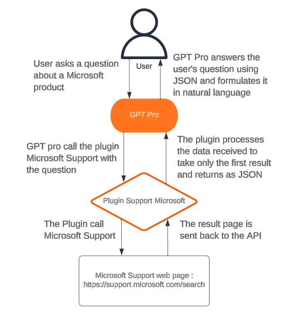
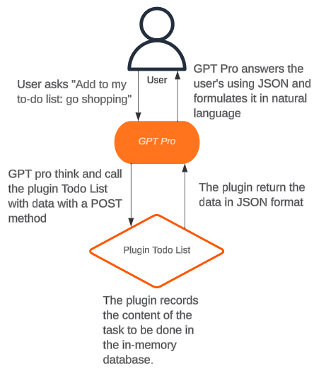

# Gpt-Pro Samples

This repository contains plugin samples for GPT Pro.

These samples are intended for beginner developers.

> #### :warning: Warning
>
> These are examples intended for learning to create a GPT Pro plugin, for some of them they cannot be used as is in production.

You are free to use them as you wish to expand the GPT Pro community.

#### Sample 1: Support Microsoft

This example contains a web API used to contact Microsoft Support (https://support.microsoft.com) and return the first response in JSON.

When a GPT Pro user asks a question related to Microsoft products, the Microsoft Support plugin is activated if GPT Pro determines that it's the best solution for the user.
GPT Pro provides the plugin with both the user's question and the language used in ISO code format. The plugin uses this information to call the Microsoft support page and process the returned web page to retrieve only the first result.
After processing the request, the plugin sends the result back to GPT Pro in JSON format. Finally, GPT Pro formulates the response from Microsoft Support in natural language that's easy for the user to understand.

#### Sample 2: Todo List

When a GPT Pro user wants to add a task to their to-do list, they can simply formulate it using keywords such as:

- "I need to go to the hairdresser"
- "Add to my to-do list: go shopping"
- "Add the 10am meeting to my list"
- "Here is my shopping list: bread, milk, butter, eggs"

GPT Pro will then understand that it has to use the To-Do List API plugin and will automatically call the POST route, providing it with the necessary data. The plugin will insert the information on the given task into memory in the database.

If the user wants to know what tasks they still need to do, they can ask clearly:

- "What do I have left to do today?"
- "Can you show me my list of tasks to do?"

GPT Pro will know that it needs to call the To-Do List API plugin and will call the GET route to retrieve the list and transmit it to the user in natural language.

> #### :warning: Warning
>
> Please note, this plugin is an example and should not be used in production as is. >The database is in memory, which is not suitable for extensive use.
