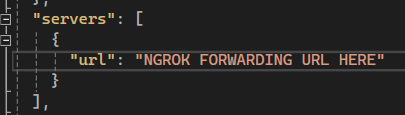
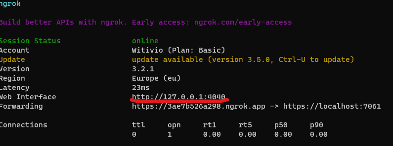

# GPT Pro: Plugin Microsoft Support


#### What this plugin do

This example contains a web API used to contact Microsoft Support (https://support.microsoft.com) and return the first response in JSON.

When a GPT Pro user asks a question related to Microsoft products, the Microsoft Support plugin is activated if GPT Pro determines that it's the best solution for the user.
GPT Pro provides the plugin with both the user's question and the language used in ISO code format. The plugin uses this information to call the Microsoft support page and process the returned web page to retrieve only the first result.
After processing the request, the plugin sends the result back to GPT Pro in JSON format. Finally, GPT Pro formulates the response from Microsoft Support in natural language that's easy for the user to understand.


#### How To Run This Sample in a local environment

##### Required Tools

- [Visual Studio](https://visualstudio.microsoft.com/fr/downloads/)
- [ngrok](https://ngrok.com/) or any other tunneling too
- [Postman](https://www.postman.com/)

##### Launch the API

##### Step 1: Clone the repository

The first step is to clone the Plugin Microsoft Support repository from Github.
`git clone https://github.com/Witivio/Gpt-Pro---Samples`

Open the Plugin Microsoft Support project in Visual Studio or Visual Studio Code. Navigate to the `Samples` folder and open `Asp.net Core - Support Microsoft.sln`.

##### Step 2: Launch the Plugin API

ngrok is used to create a public URL for the API.
Open a terminal and launch the folowing command from ngrok
`ngrok http https://localhost:7061 `

This will create a public URL that forwards traffic to the local port `https://localhost:7061 `. Copy the forwarding URL to use later.


Open the file located at `/.well-known/ai-plugin.json` and `openapi.json` and update the existing json value `servers:url` and `api:url` with the ngrok forwarding url you obtained earlier"

openapi.json

ai-plugin.json


Launch the api with Visual Studio, with F5 or click on :


##### Step 3: Test the API

Launch Postman and send a GET request to the Plugin API endpoint.
for this sample the endpoint is MicrosoftSupport

Two parameters in the query string are required:

- originalInput: This is the question you want to ask Microsoft Support in natural language
- originalLanguageFromIsoCode: The language used to ask this question in ISO code format: ex 'fr-FR', en-US etc...

Write the GET request with the base domain optained in ngrok forwarding url and click on send button

**Example of query:** `https://[yoursubdomain].ngrok.app/MicrosoftSupport?originalInput=
[yourquestion]&originalLanguageFromIsoCode=[yourlanguage]`

It should look like this in postman


You should see a JSON response similar to the following:

```JSON
{
    "result": {
        "title": "Create, send, and reply to an email - Microsoft Support",
        "linkEncoded": "aHR0cHM6Ly9zdXBwb3J0Lm1pY3Jvc29mdC5jb20vZW4tdXMvb2ZmaWNlL2NyZWF0ZS1zZW5kLWFuZC1yZXBseS10by1hbi1lbWFpbC00MDBkNGQ0NS04ZTJkLTQ2YTItOGNiNS1kZGFiZjEyNDg5ZWQ",
        "link": "https://support.microsoft.com/en-us/office/create-send-and-reply-to-an-email-400d4d45-8e2d-46a2-8cb5-ddabf12489ed",
        "description": "Type your message. Select Send. Note: Any received attachment is not added to a reply automatically. Forward to share email with others. Select an email to forward. Select Forward. Add who you'd like to forward to. Add a note in the email body if you'd like. Select Send. Note: Any received attachment is added when forwarded. Want more?",
        "appliesTo": "Applies To: Outlook for Microsoft 365, Outlook 2021, Outlook 2019, Outlook 2016",
        "isoCodeLanguage": "en-US"
    },
    "id": 326,
    "exception": null,
    "status": 5,
    "isCanceled": false,
    "isCompleted": true,
    "isCompletedSuccessfully": true,
    "creationOptions": 0,
    "asyncState": null,
    "isFaulted": false
}
```

##### Tips and Documentation

- You can track calls to the API and debug easily with the ngrok web interface
  
- To validate the description of your API, use [Swagger Validator](https://validator.swagger.io/).
- To learn more about the Swagger Specification, visit [swagger.io](https://swagger.io/specification/).

> #### :warning: Warning
>
> - A plugin name can contain only ASCII letters, digits, underscores and whitespace

:boom: :tada: Congratulations! You have successfully launched the GPT Pro Todo List Plugin API.
You can now begin creating custom plugins to extend the functionality of GPT Pro. :tada: :boom:
