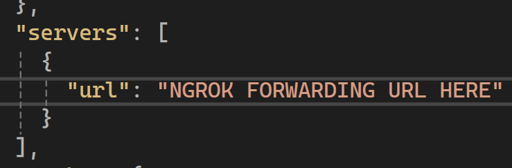
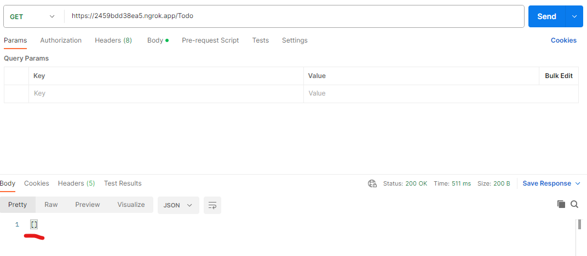
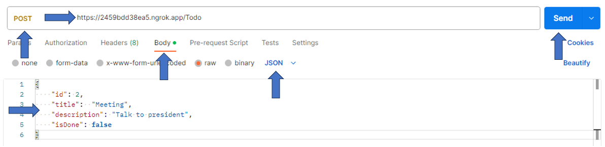

# GPT Pro: Plugin Todo List

### Todo List

This example contains a web API used to create, read, and update a task list. tasks are stored in the in-memory database and are not separated by user. This project is an example and should not be used in production

#### How To Run This Sample in a local environment

##### Required Tools

- [Visual Studio](https://visualstudio.microsoft.com/fr/downloads/)
- We recommand to use [ngrok](https://ngrok.com/)
- [Postman](https://www.postman.com/)

##### Launch the API

##### Step 1: Clone the repository

The first step is to clone the Plugin Microsoft Support repository from Github.
`git clone https://github.com/Witivio/Gpt-Pro---Samples`

Open the Plugin Microsoft Support project in Visual Studio or Visual Studio Code. Navigate to the `Samples` folder and open `Asp.net Core - Todo API.sln`.

##### Step 2: Launch the Plugin API

ngrok is used to create a public URL for the API.
Open a terminal and launch the folowing command from ngrok
`ngrok http https://localhost:7196 `

This will create a public URL that forwards traffic to the local port `https://localhost:7196 `. Copy the forwarding URL to use later.

Open the file located at `/.well-known/ai-plugin.json` and `openapi.json` and update the existing json value `servers:url` and `api:url` with the ngrok forwarding url you obtained earlier"

openapi.json

ai-plugin.json


Launch the api with Visual Studio, with F5 or click on :

##### Step 3: Test the API

Launch Postman and send a GET request to the Plugin API endpoint.
for this sample the endpoint is Todos

Write the GET request with the base domain optained in ngrok forwarding url and click on send button

**Example of query:** https://[yoursubdomain].ngrok.app/Todo

It should look like this in postman

If it you're first call, the response must be empty.
now, add a todo to the todo list.
With Postman switch to POST method
and call this same query with a body like this:

```JSON
{
  "id": "1",
  "Title":  "Go shopping",
  "Description": "Milk, butter, biscuit, bacon",
  "IsDone": false
}
```



You can add several todos to your todo list then come back to the GET method.
now, a todo list appears in the response

Don't forget that this is a demonstration plug-in, if you close and then restart the API, the data is lost

##### Tips and Documentation

- You can track calls to the API and debug easily with the ngrok web interface
- To validate the description of your API, use [Swagger Validator](https://validator.swagger.io/).
- To learn more about the Swagger Specification, visit [swagger.io](https://swagger.io/specification/).

Congratulations! You have successfully launched the GPT Pro Microsoft Support Plugin API.
You can now begin creating custom plugins to extend the functionality of GPT Pro.
